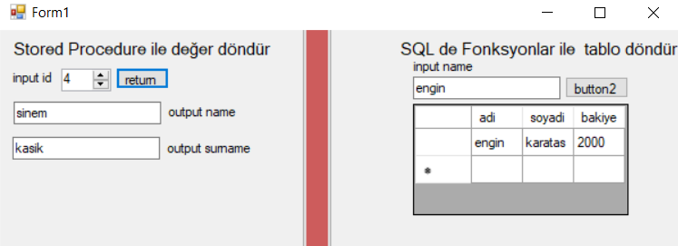
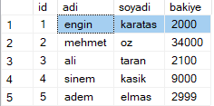

# Table Management
Return mssql to C# Stored procedure and call with user defined functions in a form app

 

 
## Usage 

- Run these 3 code blocks from mssql

### 1.

``` 
CREATE TABLE [dbo].[Musteri]
(
[ID] [int] IDENTITY(1,1) NOT NULL,
[ADI] [varchar](50) NULL,
[SOYADI] [varchar](50) NULL,
[BAKIYE] [float] NULL
)
ON [PRIMARY]
```

### 2.
``` 
CREATE function Func_MusteriGetir(@username varchar(200))  
returns table  
as  
return (select * from Musteri where ADI = @username) 
```

### 3.
``` 
Create Proc Musteriler
@ID int,
@ADI varchar (50) output, <--
@SOYADI varchar (50) output<--
As
Select @ID=ID, @ADI=ADI,@SOYADI=SOYADI From Musteri Where ID=@ID
``` 
<strong>Result</strong>

 <br>

<h3>
download repo, run & compile 
into c#..
</h3>


